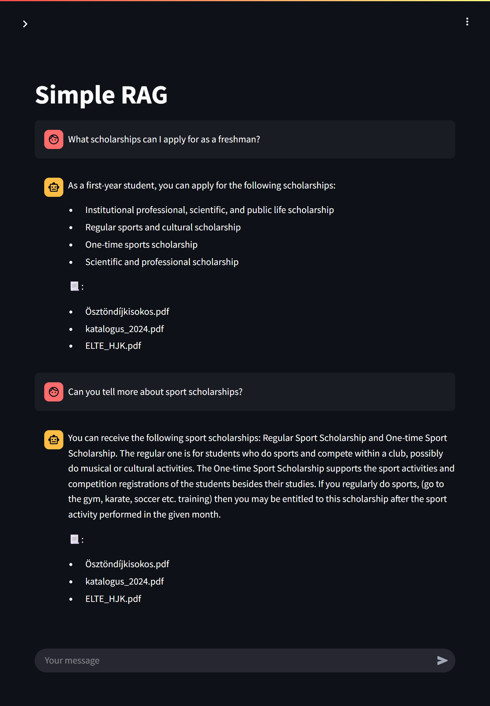
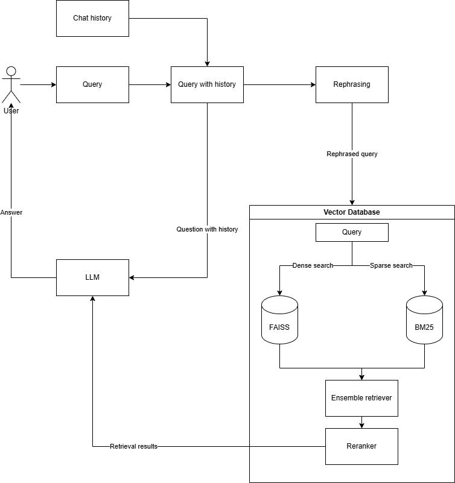

# SimpleRAG
SimpleRAG is a RAG system implementing efficient RAG methods - like hybrid search and reranking - and trying to keep everything as simple as possible.



## Tech stack
- Streamlit
- LangChain
- FAISS
- HuggingFace Embeddings & Crossencoders
- OpenAI API (also supports Gemini and Ollama)

## Features
- Hybrid search
    - BM25 for sparse vector search
    - Configurable HuggingFace embedding for dense vector search using FAISS as vector database
- Reranking (using HuggingFace Crossencoder)
- Rephrasing
- Vector database saving on disk
- Basic tokenization
- CPU or GPU vector calculations (can be changed)
- Supported document types are: *pdf, docx, html* by default, but in the `requirements.txt` you can extend the unstructured package. [Unstructured supported document types](https://docs.unstructured.io/open-source/core-functionality/partitioning)

## Architecture


## How to start
1. Copy the *.env.sample* file and rename it to *.env*
2. Fill the *.env* file with the empty [environment variables](#env-vars). Also can configure the others for your taste.
3. Navigate the shell to the root directory of this repo: `cd simple-rag`
### Python
4. (Optional, but recommended) Create a [virtual environment](https://docs.python.org/3/library/venv.html) and activate it
5. Install required packages: `pip install -r requirements.txt`
6. Start the app with `streamlit run app/app.py loadenv` (loadenv flag is for loading the environment variables)
### Docker
4. Create a docker image using the *Dockerfile* with `docker build --tag simple-rag .`
5. Run the docker container passing the `.env` file and mapping the folder for the documents (and for the persistent vector db - this one is optional)
```
docker run -p 8501:8501 --env-file .env \
    -v <folder-containing-documents>:/app/<DOCUMENTS_DIR>:ro \
    -v <path-to-persist-vectordb>:/app/<DB_DIRECTORY>:rw \
    simple-rag
```
6. Navigate to `https://localhost:8501` on your browser

## Env vars

| Variable name           | Description                                                                                                                                                                        |
| ----------------------- | ---------------------------------------------------------------------------------------------------------------------------------------------------------------------------------- |
| EMBEDDING_MODEL         | Name of the embedding model used for creating dense embeddings. **Should be available on HuggingFace.**                                                                            |
| LLM_MODEL               | Name of the LLM model used for generating the response. Model is accessed through the OpenAI API.                                                                                  |
| RERANKER                | Name of the Cross-encoder reranker model used for reranking the results from hybrid search. **Should be available on HuggingFace.**                                                |
| DEVICE                  | Target device for calculating the embeddings, *cpu* or *cuda*. For switching to GPU, also change the dependency *faiss-cpu* to *faiss-gpu*. |
| TEMPERATURE             | Temperature setting for the LLM model. Lower values would result more deterministic answers, while higher values would make the LLM more creative. Ranges between 0.0 - 1.0. |
| OPENAI_API_URL          | Base URL of the OpenAI API endpoint for the LLM.                                                                                                                                        |
| OPENAI_API_KEY          | API key for the OpenAI API.                                                                                                                                                        |
| DOCUMENTS_DIR           | Root directory of the documents to be indexed (only text-based documents are supported currently).                                                                                 |
| DOCUMENTS_GLOB          | Regular expression for filtering the documents in the DOCUMENTS_DIR to be indexed.                                                                                                 |
| CHUNK_SIZE              | Size of the document chunks to be indexed.                                                                                                                                         |
| CHUNK_OVERLAP           | Overlap between the document chunks.                                                                                                                                               |
| DB_DIRECTORY            | Root directory for the vector database, when saving it to disk.                                                                                                                    |
| VECTOR_RETRIEVER_TOP_K  | Number of elements to retrieve using dense vector retrieval.                                                                                                                       |
| KEYWORD_RETRIEVER_TOP_K | Number of elements to retrieve using sparse vector (or keyword) retrieval.                                                                                                         |
| RERANKER_TOP_K          | Number of elements the reranker should select from the previously retrieved ones. Should **not** be bigger than VECTOR_RETRIEVER_TOP_K +KEYWORD_RETRIEVER_TOP_K                    |

## How to set up with Ollama, or Gemini
You can simply modify the OPENAI_API_URL environment variable to the OpenAI API compatible URL of the server, for example:
- Ollama: http://localhost:11434/v1 \
In case of Ollama, the *OPENAI_API_KEY* can be anything, but should not be empty
- Gemini: https://generativelanguage.googleapis.com/v1beta/openai/

## Known issues
- Runtime errors appearing on the command line during the inference because of async calls and streamlit. ([Discuss](https://discuss.streamlit.io/t/streamlit-and-asynchronous-functions/30684/3))

## Future improvements
- [ ] Improve rephraseing (also checking whether db query is needed)
- [ ] File management from the user interface
- [ ] Persist keyword retriever's database on disk (e.g.: with ElasticSearch)