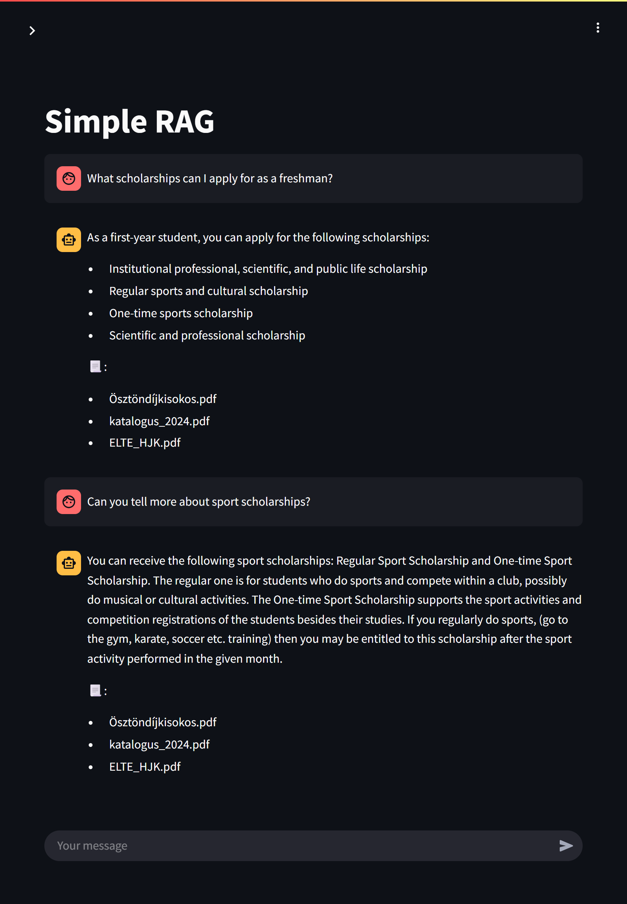
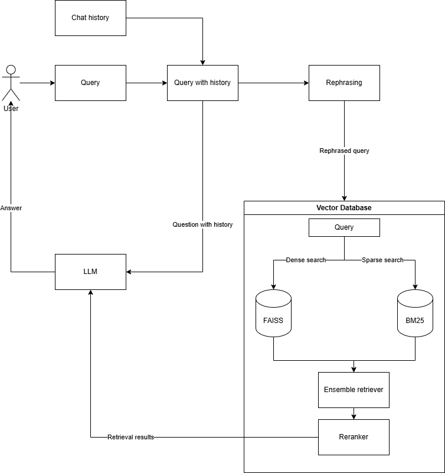

# SimpleRAG
SimpleRAG is a minimal, production-minded Retrieval-Augmented Generation (RAG) system. It implements efficient retrieval techniques (hybrid BM25 + dense embeddings) with cross-encoder reranking, while keeping setup and usage simple.



## Tech stack
- Streamlit (UI)
- LangChain (orchestration)
- FAISS (vector store)
- Hugging Face (embeddings and cross-encoders)
- OpenAI-compatible API (OpenAI, Gemini, Ollama)

## Features
- Hybrid retrieval
  - BM25 sparse keyword search
  - Configurable Hugging Face embeddings for dense search using FAISS
- Cross-encoder reranking (Hugging Face)
- Query rephrasing
- On-disk vector DB persistence
- Basic tokenization
- CPU or GPU inference
- Supported document types: pdf, docx, html (extensible via Unstructured; see docs)

## Architecture


## Quick start
1) Copy *.env.sample* to *.env*
2) Fill the required environment variables (see [Configuration](#configuration) below)
3) Open a terminal in the repo root: `cd simple-RAG`

### Run with Python
4) (Recommended) Create and activate a [virtual environment](https://docs.python.org/3/library/venv.html)
5) Install dependencies: `pip install -r requirements.txt`
6) Start the app: `streamlit run app/app.py loadenv`

### Run with Docker
4) Build the image: `docker build --tag simple-rag .`
5) Run the container (map your documents folder and optional DB persistence):
```
docker run -p 8501:8501 --env-file .env ^
  -v <folder-containing-documents>:/app/<DOCUMENTS_DIR>:ro ^
  -v <path-to-persist-vectordb>:/app/<DB_DIRECTORY>:rw ^
  simple-rag
```
6) Open http://localhost:8501

## Configuration
Provide settings via environment variables in `.env`.

| Variable name           | Description                                                                                                                                                                     |
| ----------------------- | ------------------------------------------------------------------------------------------------------------------------------------------------------------------------------- |
| EMBEDDING_MODEL         | Hugging Face embedding model for dense vectors.                                                                                                                                 |
| LLM_MODEL               | Model name used via an OpenAI-compatible API endpoint.                                                                                                                         |
| RERANKER                | Hugging Face cross-encoder model for reranking.                                                                                                                                |
| DEVICE                  | Target device: `cpu` or `cuda`. For GPU, use faiss-gpu instead of faiss-cpu and ensure CUDA is available.                                                                          |
| TEMPERATURE             | LLM temperature (0.0–1.0). Lower = more deterministic.                                                                                                                         |
| OPENAI_API_URL          | Base URL of the OpenAI-compatible API (e.g., OpenAI, Gemini, Ollama).                                                                                                          |
| OPENAI_API_KEY          | API key for the chosen provider. (For Ollama, any non-empty string works.)                                                                                                     |
| DOCUMENTS_DIR           | Directory containing documents to index.                                                                                                                                       |
| DOCUMENTS_GLOB          | (Optional) Glob/regex filter for files inside DOCUMENTS_DIR.                                                                                                                              |
| CHUNK_SIZE              | Chunk size for splitting documents.                                                                                                                                            |
| CHUNK_OVERLAP           | Overlap size between chunks.                                                                                                                                                   |
| DB_DIRECTORY            | Directory where the vector DB is persisted.                                                                                                                                    |
| VECTOR_RETRIEVER_TOP_K  | Number of results to retrieve from the dense retriever.                                                                                                                        |
| KEYWORD_RETRIEVER_TOP_K | Number of results to retrieve from the sparse (keyword) retriever.                                                                                                             |
| RERANKER_TOP_K          | Final results kept after reranking. Must be ≤ VECTOR_RETRIEVER_TOP_K + KEYWORD_RETRIEVER_TOP_K.                                                                                |

Example .env (adjust to your setup):
```
EMBEDDING_MODEL=sentence-transformers/all-MiniLM-L6-v2
LLM_MODEL=gpt-4o-mini
RERANKER=cross-encoder/ms-marco-MiniLM-L-6-v2

DEVICE=cpu
TEMPERATURE=0.2

OPENAI_API_URL=https://api.openai.com/v1
OPENAI_API_KEY=sk-...

DOCUMENTS_DIR=data/docs
DOCUMENTS_GLOB=**/*.*

CHUNK_SIZE=1000
CHUNK_OVERLAP=150

DB_DIRECTORY=.rag_index

VECTOR_RETRIEVER_TOP_K=8
KEYWORD_RETRIEVER_TOP_K=8
RERANKER_TOP_K=8
```

### Using Ollama or Gemini
- Ollama
  - OPENAI_API_URL=http://localhost:11434/v1
  - OPENAI_API_KEY=ollama
  - Ensure LLM_MODEL matches a pulled Ollama model (e.g., llama3)
- Gemini (OpenAI-compatible)
  - OPENAI_API_URL=https://generativelanguage.googleapis.com/v1beta/openai/
  - OPENAI_API_KEY=your-gemini-api-key
  - Set LLM_MODEL to a valid Gemini name exposed by the compatibility layer

## Usage
- Place your documents under DOCUMENTS_DIR; ensure DOCUMENTS_GLOB matches your files.
- Start the app and ask questions; the index is built on first run and persisted to DB_DIRECTORY.
- Supported types by default: pdf, docx, html. Extend via Unstructured if needed:
  https://docs.unstructured.io/open-source/core-functionality/partitioning

## Troubleshooting
- Streamlit + async warnings during inference are expected and harmless:
  https://discuss.streamlit.io/t/streamlit-and-asynchronous-functions/30684/3
- First run may be slow due to model downloads/caching.
- GPU: set DEVICE=cuda and install faiss-gpu; verify CUDA is available (nvidia-smi).

## Roadmap
- [ ] Improve rephrasing (and determine when DB retrieval is needed)
- [ ] File management from the UI
- [ ] Persist the keyword retriever’s index (e.g., Elasticsearch)
